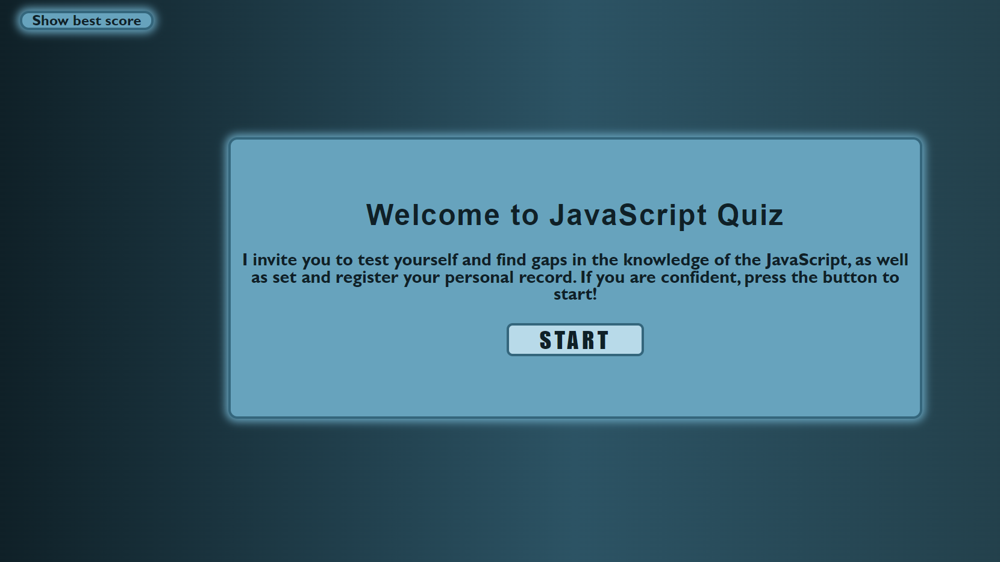
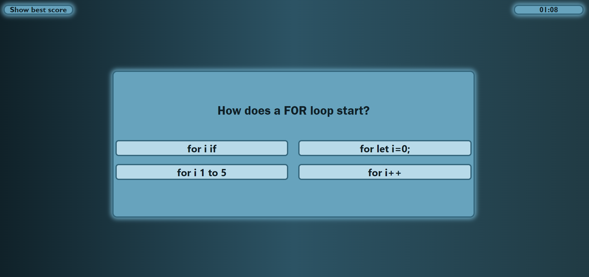
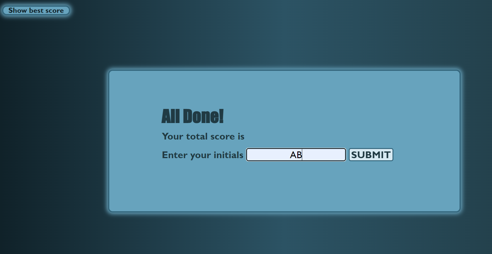
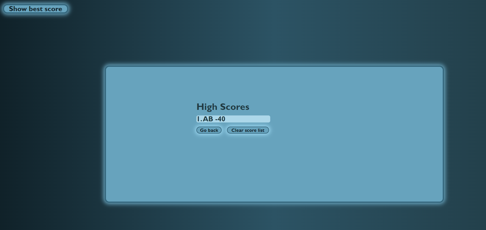

# Show Your Knowlege

## Description

The knowledge gained on the course motivated me to start creating this project. This project provides a quick test of your knowledge of the JavaScript language. Testing is complicated by the fact that time is limited. Also, the files with the code of this project are great as a tutorial for beginner developers.

Repository: [repo](https://github.com/RufatEskendarov/show-your-knowlege)

WebApp: [webapp]()

## User Story:

AS A coding boot camp student:
I WANT to take a timed quiz on JavaScript fundamentals that stores high scores
SO THAT I can gauge my progress compared to my peers.

## Acceptance Criteria:

- GIVEN I am taking a code quiz
- WHEN I click the start button
  THEN a timer starts and I am presented with a question;
- WHEN I answer a question
  THEN I am presented with another question;
- WHEN I answer a question incorrectly
  THEN time is subtracted from the clock;
- WHEN all questions are answered or the timer reaches 0
  THEN the game is over;
- WHEN the game is over
  THEN I can save my initials and score.

## Installation

This application does not require installation, just follow the link:

## Usage

1. By clicking on the link to the webapp, you will be taken to the home page with a welcome text and the "START" button. To start testing, click on the button (Screen-1);
2. After pressing the 'START' button, the first question will appear on the screen and at the same time the timer in the upper right corner of the timer is designed for 70 seconds. Be careful, each wrong answer will take 10 seconds from the total time (Screen-2);
3. After answering all questions or running out of time, you will be transferred to the submission page. Enter your initials. The program is not case sensitive, it will automatically convert all initials to uppercase (Serin-3);
4. By clicking on the submit button, the list with the highest scores will appear on the screen. By clicking on the "Clear sheet" button, you can clear the entire sheet of records, or you can click on the "Go-back" button and move to the home page and start testing a new one (Screen-4).

## Credits

In this project, I used the methods and templates acquired in the JavaScript course from Jonas Schmidtmann [JonasSchmidtman](https://www.udemy.com/course/the-complete-javascript-course/).

## License

In accordance with https://choosealicense.com/licenses/gpl-3.0/

## Features

- HTML5
- CSS3
- JavaScript
- DOM manipulations

## How to Contribute

Please review my page if you have ideas or advises please contact me (rufat.eskendarov@gmail.com)

## Tests

Manual testing was carried out on the application, no errors or bugs were found. If you encounter problems while using the app, please contact me (rufat.eskendarov@gmail.com).
